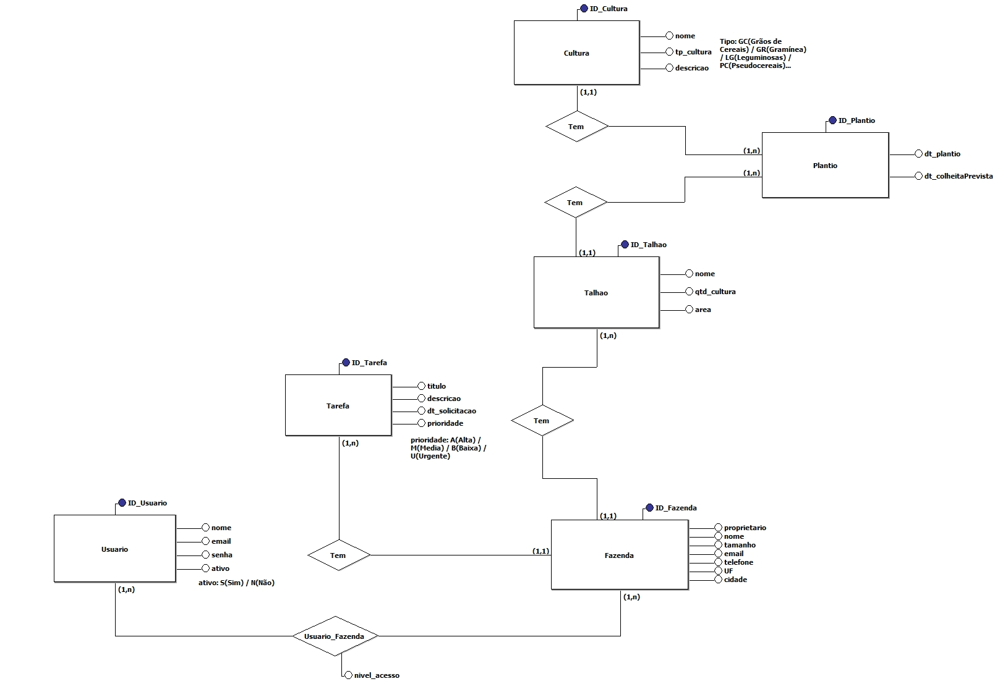

# 🌿 Emityma — Sistema de Gestão de Fazendas

**Emityma** é uma plataforma digital voltada para o gerenciamento eficiente de propriedades rurais. O nome deriva do tupi antigo, significando "plantação" ou "coisa plantada", refletindo a conexão profunda com a terra e a agricultura.

## 📌 Sobre o Projeto

O objetivo do Emityma é oferecer uma solução integrada para produtores rurais, permitindo o controle detalhado de todas as atividades da fazenda, desde o planejamento de culturas até a gestão financeira, promovendo sustentabilidade e aumento de produtividade.

## ⚙️ Funcionalidades

- **Cadastro de Fazendas e Talhões**: Gerencie múltiplas propriedades e subdivisões.
- **Gestão de Culturas**: Acompanhe o ciclo de vida das plantações, desde o plantio até a colheita.
- **Controle de Animais e Lotes**: Monitore rebanhos, incluindo informações sobre espécies, raças e saúde.
- **Gerenciamento de Funcionários**: Registre dados de colaboradores e atribua tarefas específicas.
- **Controle de Equipamentos e Manutenções**: Mantenha um histórico de máquinas e suas manutenções preventivas e corretivas.
- **Gestão de Estoques**: Controle entradas e saídas de insumos, como sementes, fertilizantes e rações.
- **Financeiro**: Registre receitas e despesas, com categorização e geração de relatórios.
- **Usuários e Permissões**: Sistema de autenticação com diferentes níveis de acesso.

## 🗂️ Modelo Conceitual (Provisório)

O sistema é estruturado com as seguintes entidades principais:

- **Fazenda**
- **Talhão**
- **Cultura**
- **Animal**
- **Lote**
- **Funcionário**
- **Tarefa**
- **Equipamento**
- **Manutenção**
- **Estoque**
- **Movimentação de Estoque**
- **Receita/Despesa**
- **Usuário**

As relações entre essas entidades permitem uma visão holística da operação da fazenda, facilitando a tomada de decisões baseada em dados.

## 🎨 Identidade Visual

O logotipo do Emityma incorpora elementos que representam a conexão com a natureza e a agricultura:

## 🚀 Tecnologias Utilizadas

- **Frontend**: Bootstrap
- **Backend**: Django

